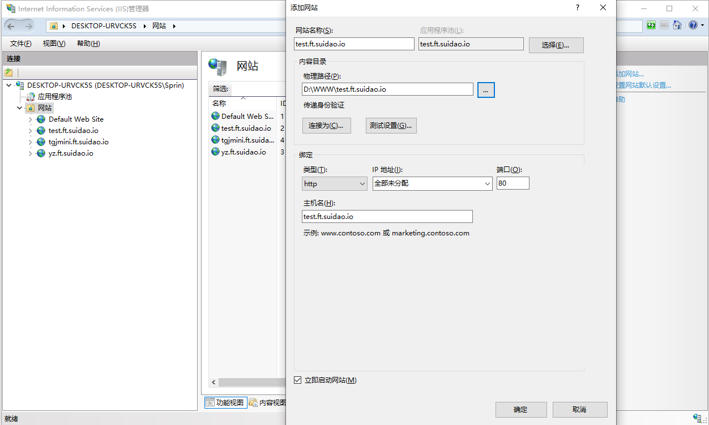
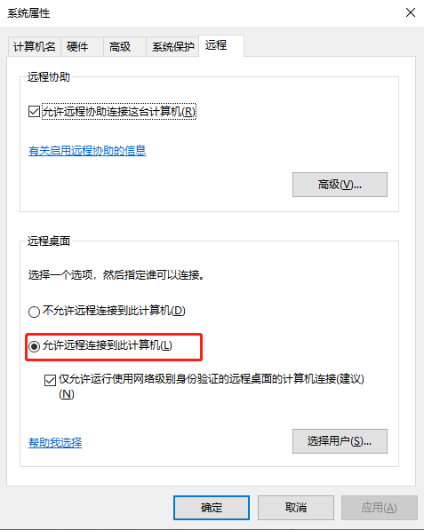
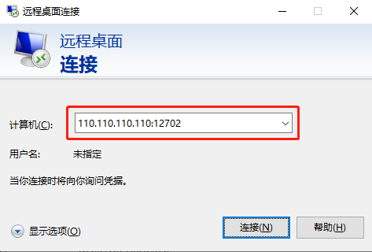

<div align="center">
  


## FastTunnel
[](https://www.apache.org/licenses/LICENSE-2.0)
[](https://github.com/SpringHgui/FastTunnel/actions)
[](https://www.nuget.org/packages/FastTunnel.Core/)
[](https://www.nuget.org/packages/FastTunnel.Core/)

[README](README.md) | [中文文档](README_zh.md)
  
  ***This project supports any commercial and secondary development activities, but seriously despises plagiarizing and copying the code, implementation scheme or architecture of this project and repackaging them into their own open source works.***
  
</div>


## What is FastTunnel？
- FastTunnel is a high-performance cross-platform intranet penetration tool. With it, you can expose intranet services to the public network for yourself or anyone to access.
- Unlike other penetration tools, the FastTunnel project is committed to creating an easy-to-extensible and easy-to-maintain intranet penetration framework.
- You can build your own penetration application by referencing the nuget package of `FastTunnel.Core`, and target the business extension functions you need.


***

Official website : https://suidao.io  

The penetration platform developed based on this framework, if you need intranet penetration, you can register and use it directly, eliminating the cost of building and maintaining yourself.
But do not use this service for important items.

OpenSource：

GitHub : [FastTunnel](https://github.com/SpringHgui/FastTunnel)  
Gitee: [FastTunnel](https://gitee.com/Hgui/FastTunnel)

**If helpful, click on ⭐Star to support this project, please submit an issue if you have needs and bugs, and welcome coder to PR**

## Get GVP


***

## What can FastTunel do？
- [x] Remote intranet computer Windows/Linux/Mac
- [x] Use a custom domain name to access intranet web services (usually used for WeChat development)
- [x] Port forwarding/port mapping, access services provided by any port on the intranet mysql, redis, ftp, etc.
- [ ] p2p penetration
- [x] Support binding multiple domain names to access intranet services
- [x] Support domain name whitelist restriction
- [x] Support client identity verification

## Quickstart
1. Download the corresponding program on the [releases](https://github.com/SpringHgui/FastTunnel/releases) page
2. Modify the client and server configuration files according to your needs`appsettings.json`
3. Run FastTunnel.Server
4. Run FastTunnel.Cient

## Install FastTunel.Sever using Docker Engine
Configuration files and log files are mounted through volume. If this image has been run before, docker may not update to the latest image. Please delete the existing image manually, and then execute the following command

```
docker run --detach \
  --publish 1270:1270 --publish 1271:1271 \
  --name FastTunnel \
  --restart always \
  --volume /var/FastTunnel/config:/app/config \
  --volume /var/FastTunnel/Logs:/app/Logs \
  springhgui/fasttunnel:latest
```
## Run on Linux/Mac os？
#### Windows
Double click directly `FastTunnel.Client.exe` to run
#### Linux
`chmod +x FastTunnel.Client`  
`./FastTunnel.Client`
#### Mac
click directly `FastTunnel.Client` to run

## Configuration example
### 1. Use a custom domain name to access intranet web services
- For example, you have a server with a public IP address of `110.110.110.110`, and you have a domain name with a top-level domain name of `abc.com`, you want to visit a website on the intranet by visiting `test.abc.com`
- You need to add a DNS resolution for the domain name address, the type is `A`, the name is `*`, and the ipv4 address is `110.110.110.110`, so that all domain names of `*.abc.com` will point to `110.110.110.110`’s server, because the default http port of `FastTunnel` is 1270, so you need to visit`http://test.abc.com:1270`

- #### If you don't want to bring the port number every time you visit, you can use `nginx` forwarding.
```
http {
    # add resolver 
    resolver 8.8.8.8;

    # set *.abc.com to 1270 port
    server {
      server_name  *.abc.com;
      location / {
         proxy_pass http://$host:1270;
         proxy_set_header   Host             $host;
         proxy_set_header   X-Real-IP        $remote_addr;
         proxy_set_header   X-Forwarded-For  $proxy_add_x_forwarded_for;
      }

      # 可选
      error_log /var/log/nginx/error_ft.log error;
    }
}
```

- If the domain name configured on the server is `ft.suidao.io`, then access the local site through the subdomain name `test.ft.suidao.io:1270`, the IIS configuration is as follows:


### 2. Remote intranet computer Windows/Linux/Mac

The client configuration is as follows, there are two hosts in the intranet, and the ip is as follows:
appsettings.json
```
 "ClientSettings": {
    "Common": {
      "ServerAddr": "xxx.xxx.xxx.xxx",
      "ServerPort": 1271
    },
    "SSH": [
      {
        "LocalIp": "192.168.0.100", // linux pc
        "LocalPort": 22,            // ssh default port
        "RemotePort": 12701
      },
      {
        "LocalIp": "192.168.0.101", // windows pc
        "LocalPort": 3389,          // windows default port for Remote
        "RemotePort": 12702
      }
    ]
  }
```
#### remote intranet linux host by ssh (ip:192.168.0.100)

Assuming that the user name of the intranet host is root, the server ip is x.x.x.x, and the two hosts that access the intranet are as follows
```
ssh -oPort=12701 root@x.x.x.x
```

#### remote desktop Windows host by mstsc (ip:192.168.0.101)
#### Controlled terminal setting
- Open cmd and enter the command `sysdm.cpl` in the pop-up dialog box and select Allow remote connection to this computer


#### Control terminal settings
- Open cmd and enter the command `mstsc`, open the remote dialog box, enter `x.x.x.x:12701` in the computer input box of the dialog box, and then specify the user name and password to remote the windows host of the intranet

    
## Development/PR
- install `vs2019` last version
- install `.net5` or higher `https://dotnet.microsoft.com/download/dotnet/5.0`
- add `test.test.cc   127.0.0.1` in system host file
- run fasttunnel.server
- run fasttunnel.client

## contributors
<a href = "https://github.com/FastTunnel/FastTunnel/graphs/contributors">
  
</a>

## Join QQ Group

<div align="center"></div>  

## License
Apache License 2.0
