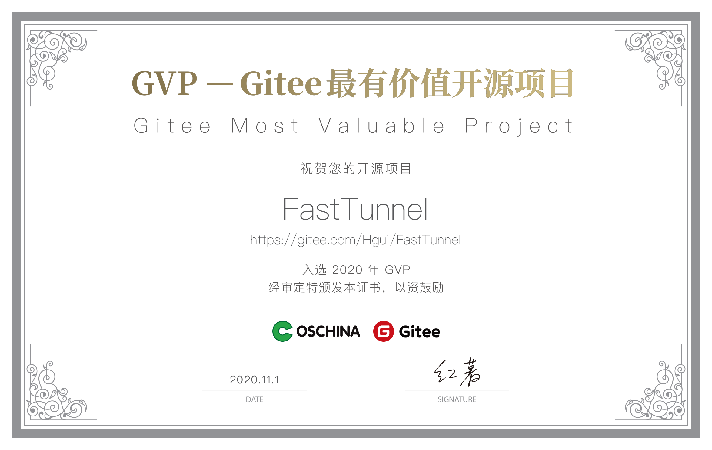

## FastTunnel-内网穿透

[README](README.md) | [中文文档](README_zh.md)

***

## FastTunnel
高性能跨平台内网穿透工具，使用它可以实现将内网服务暴露到公网供自己或任何人访问。
- 与其他穿透工具不同的是，FastTunnel项目致力于打造一个易于扩展、易于维护的内网穿透框架。
- 你可以通过引用`FastTunnel.Core`的nuget包构建出自己的穿透应用，并针自己所需的业务扩展功能。

## 文档
[https://docs.suidao.io](https://docs.suidao.io)

**使用内网穿透暴露3389端口的，一定要注意，电脑的密码一定要设置复杂一点，避免被黑客破解计算机登录密码，造成损失。**   
**使用内网穿透暴露3389端口的，一定要注意，电脑的密码一定要设置复杂一点，避免被黑客破解计算机登录密码，造成损失。**   
**使用内网穿透暴露3389端口的，一定要注意，电脑的密码一定要设置复杂一点，避免被黑客破解计算机登录密码，造成损失。**   
 
## 立即体验内网穿透
官网：https://suidao.io  

此网站基于本框架开发的穿透平台，用于分享测试使用，如果你需要低频使用内网穿透可以直接注册使用，免去自己搭建和维护的成本；但生产项目请勿使用此服务。

## 开源仓库地址
[GitHub](https://github.com/SpringHgui/FastTunnel)  
[Gitee](https://gitee.com/Hgui/FastTunnel)

**有帮助的朋友点下右上角项目的⭐Star支持一下本项目，有需求和bug请提交issue，同时欢迎各位coder进行PR**

## GVP最有价值开源项目

## FastTunnel有哪些特性
- [x] 在任何地方远程内网计算机(公司或家里的计算机) Windows/Linux/Mac
- [x] 通过自定义域名访问内网web服务（常用于微信开发或对外开放web服务）
- [x] 端口转发/端口映射，访问内网任意端口提供的服务 mysql、redis、ftp等等
- [ ] p2p穿透
- [x] 支持绑定多个域名访问内网服务
- [x] 支持域名白名单限制
- [x] 支持客户端身份校验

## 感谢以下贡献者
  

## QQ群交流群
加群交流FastTunnel相关的使用问题、bug、需求等

  
  

## License
Apache License 2.0

## 特别声明

本项目已加入 [dotNET China](https://gitee.com/dotnetchina)  组织。 

